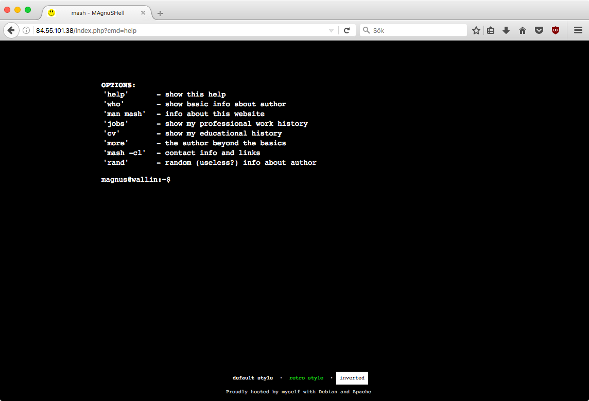
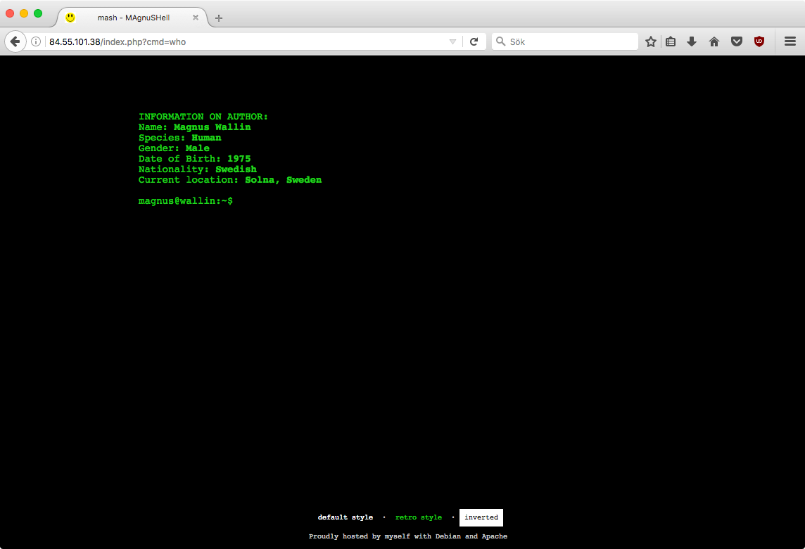
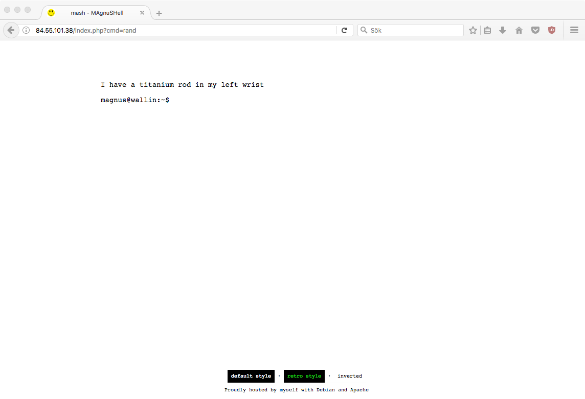

# mash
**mash - `MAgnuSHell`**

My personal web site. Emulates the Bash shell (sort of).
I wrote this just for fun in `html`, `css`, `php` and `javascript`.

<h2>Default:</h2>

<h2>"retro" style:</h2>

<h2>inverted:</h2>

